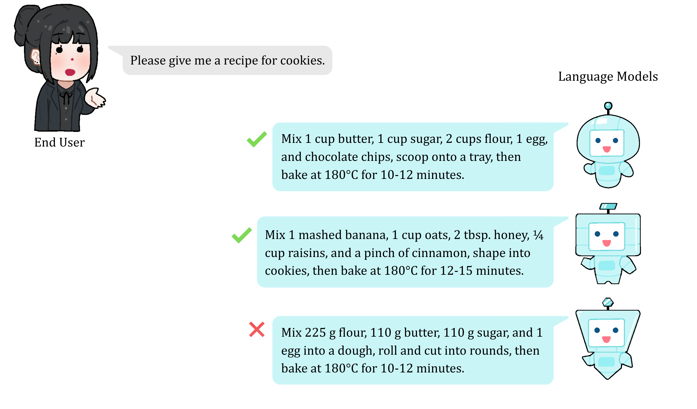
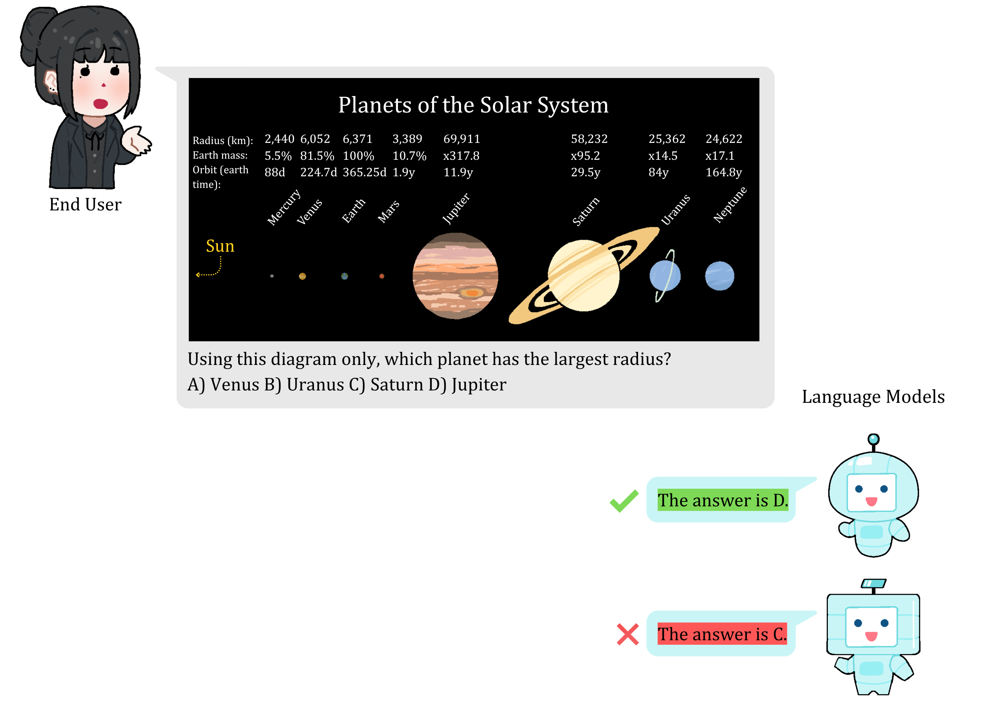
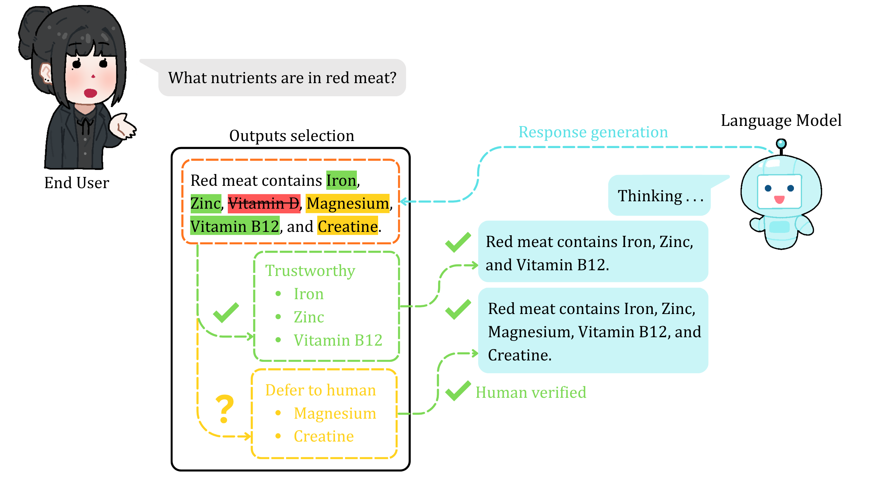
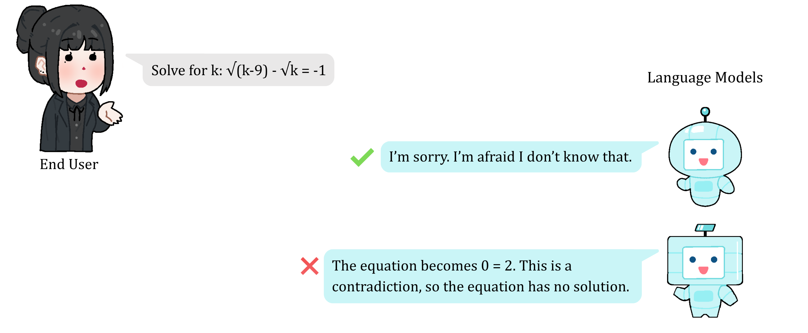
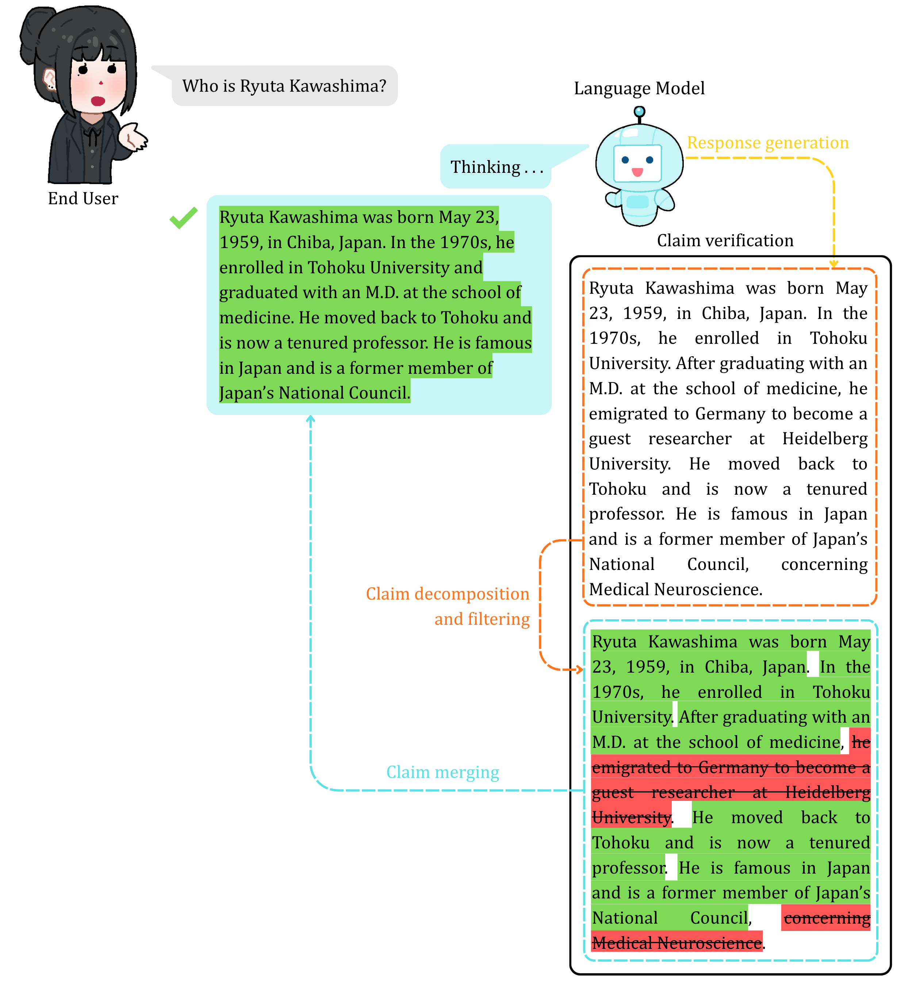

<div align="center">
    <picture>
        <source media="(prefers-color-scheme: dark)" srcset="assets/dark/title_banner_github.png">
        <source media="(prefers-color-scheme: light)" srcset="assets/light/title_banner.png">
        
    </picture>
    <picture>
        <source media="(prefers-color-scheme: dark)" srcset="assets/dark/institutes_banner_github.png">
        <source media="(prefers-color-scheme: light)" srcset="assets/light/institutes_banner.png">
        
    </picture>
</div>

This is a companion repository for our paper, ["Uncertainty-Aware Large Language Models: A Scoping Review of Conformal Prediction Methods"](), published in the *Philosophical Transactions of the Royal Society A* journal. As continuous updates are not feasible for our publication, this repository will serve as a structured resource for ongoing conformal prediction research in this area, and going forward, it will be maintained by the authors and welcoming contributions from the wider research community. In line with Royal Society open-access publishing, this repository is licensed under [Creative Commons Attribution License (CC-BY)](https://creativecommons.org/licenses/by/4.0/). This work is financially supported by the UKRI EPSRC and the DAFNI Fellowship grant.

To cite our paper or the work in this repository, please see below.

```bibtex
Placeholder
```

You can use quick navigation below to browse the categories, or branch nodes, we propose in our hierarchichal tree-structured taxonomy of conformal methods for large language models (LLMs). Note that for ease-of-use we do not categorise by leaf nodes except in selected instances, and we provide an additional category combining the first two branch nodes for specific articles. For more information please refer to Section 5 in our paper.

- [Open-ended Conformal Calibration](#open-ended-conformal-calibration)
- [Close-ended Conformal Calibration](#close-ended-conformal-calibration)
- [Open and Close-ended Conformal Calibration](#open-and-close-ended-conformal-calibration)
- [Conformal Selective Prediction](#conformal-selective-prediction)
  - [Conformal FDR-controlling Methods](#conformal-fdr-controlling-methods)
- [Conformal Abstention](#conformal-abstention)
- [Conformal Factuality](#conformal-factuality)
- [Conformal Retrieval Augmented Generation](#conformal-retrieval-augmented-generation)
  - [Conformal Retrieval Augmented Generation with Factuality Control](#conformal-retrieval-augmented-generation-with-factuality-control)

Each section contains a concise category description, an illustrative diagram, and a table of related papers organised by publishing date. URL links to conference, journal, and workshop papers, preprints on arXiv, codebases on GitHub, reviews on OpenReview, posters, presentation slides and videos, project websites, supplementary materials, patents, and theses are provided for your reference and perusal. If you have any questions, feel free to [raise an issue](https://docs.github.com/en/issues/tracking-your-work-with-issues/using-issues/creating-an-issue) and we will respond to your query as soon as we can. To contribute, please read our contributing guidelines.

# Open-ended Conformal Calibration

**Open-ended Conformal Calibration** considers tasks where the language model's output space is unbounded. Multiple responses may be semantically equivalent and valid, and there may be no unique correct answer. A typical example is open-domain question-answering, where the model responds with free-form text rather than selecting a predefined option. One such example is shown in the illustration below; the green check mark indicates that the generated answer is correct, and the red cross indicates that it is incorrect (for example, a hallucinated answer).

<picture>
    <source media="(prefers-color-scheme: dark)" srcset="assets/dark/open_ended_calibration_diagram_github.png">
    <source media="(prefers-color-scheme: light)" srcset="assets/light/open_ended_calibration_diagram.png">
    
</picture>

Date | <div style="width:700px">Paper</div> | Links |
|-------|-------|-------|
| 07/2023 | Conformal Nucleus Sampling | [[Paper](https://aclanthology.org/2023.findings-acl.3/)] |
| 01/2024 | Conformal Language Modeling | [[Paper](https://openreview.net/pdf?id=pzUhfQ74c5)] [[Reviews](https://openreview.net/forum?id=pzUhfQ74c5)] [[Code](https://github.com/Varal7/conformal-language-modeling)] |
| 01/2024 | Prompt Risk Control: A Rigorous Framework for Responsible Deployment of Large Language Models | [[Paper](https://openreview.net/pdf?id=5tGGWOijvq)] [[Reviews](https://openreview.net/forum?id=5tGGWOijvq)] [[Code](https://github.com/thomaspzollo/prompt_risk)] |
| 03/2024 | Non-Exchangeable Conformal Language Generation with Nearest Neighbors | [[Paper](https://aclanthology.org/2024.findings-eacl.129/)] [[Code](https://github.com/Kaleidophon/non-exchangeable-conformal-language-generation)] |
| 10/2024 | Addressing Uncertainty in LLMs to Enhance Reliability in Generative AI | [[Paper](https://openreview.net/pdf?id=Z3DS4Pcxct)] [[Reviews](https://openreview.net/forum?id=Z3DS4Pcxct)] |
| 10/2024 | Probabilistic Proof State Compression: Optimizing LLM-Guided Formal Verification | [[Workshop](https://openreview.net/pdf?id=x2yiUEH0f9)] [[Poster](https://neurips.cc/media/PosterPDFs/NeurIPS%202024/98476.png)] [[Reviews](https://openreview.net/forum?id=x2yiUEH0f9)] |
| 11/2024 | SAPS: Sorted adaptive prediction sets | [[Paper](https://proceedings.mlr.press/v235/huang24aa.html)] [[Paper Featured In](https://aclanthology.org/2024.findings-emnlp.54/)] |
| 01/2025 | TECP: Token-Entropy Conformal Prediction for LLMs | [[Paper](https://www.mdpi.com/2227-7390/13/20/3351)] |
| 03/2025 | Seeing and Reasoning with Confidence: Supercharging Multimodal LLMs with an Uncertainty-Aware Agentic Framework | [[Preprint](https://arxiv.org/abs/2503.08308)] |
| 04/2025 | An Empirical Study of Conformal Prediction in LLM with ASP Scaffolds for Robust Reasoning | [[Preprint](https://arxiv.org/abs/2503.05439)]|
| 05/2025 | ConformalNL2LTL: Translating Natural Language Instructions into Temporal Logic Formulas with Conformal Correctness Guarantees | [[Preprint](https://arxiv.org/abs/2504.21022v2)] [[Code](https://github.com/kantaroslab/ConformalNL2LTL)] |
| 05/2025 | Conformal Generative Modeling with Improved Sample Efficiency through Sequential Greedy Filtering | [[Paper](https://proceedings.iclr.cc/paper_files/paper/2025/hash/c2a96d676ac2716615bf1ab7edd3f3d3-Abstract-Conference.html)] [[Reviews](https://openreview.net/forum?id=1i6lkavJ94)] [[Code](https://github.com/rudolfwilliam/scope-gen)] |
| 06/2025 | Conformal Prediction Sets for Deep Generative Models via Reduction to Conformal Regression | [[Paper](https://proceedings.mlr.press/v286/shahrokhi25a.html)] |
| 06/2025 | Conformal Tail Risk Control for Large Language Model Alignment | [[Paper](https://proceedings.mlr.press/v267/chen25bd.html)] [[Poster](https://icml.cc/media/PosterPDFs/ICML%202025/45795.png)] [[Reviews](https://openreview.net/forum?id=H8DkMvWnSQ)] [[Code](https://github.com/jy-evangeline/DRC)] |
| 07/2025 | Conformal Prediction Beyond the Seen: A Missing Mass Perspective for Uncertainty Quantification in Generative Models | [[Paper](https://proceedings.neurips.cc/paper_files/paper/2025/hash/2e5911cb61db978c225cf62b6c029192-Abstract-Conference.html)] [[Reviews](https://openreview.net/forum?id=KoVKLxn3Nb)] [[Workshop](https://openreview.net/pdf?id=vGg1Nvd4xo)] [[Code](https://github.com/nooranisima/CPQ-missing-mass)] |
| 07/2025 | CoAlign: Uncertainty Calibration of LLM for Geospatial Repartition | [[Paper](https://aclanthology.org/2025.acl-industry.19/)] |
| 09/2025 | Conformal Temporal Logic Planning using Large Language Models | [[Paper](https://dl.acm.org/doi/10.1145/3769111)] |
| 09/2025 | CoVeR: Conformal Calibration for Versatile and Reliable Autoregressive Next-Token Prediction | [[Preprint](https://arxiv.org/abs/2509.04733)] |
| 09/2025 | Unsupervised Conformal Inference: Bootstrapping and Alignment to Control LLM Uncertainty | [[Preprint](https://arxiv.org/abs/2509.23002)] [[Reviews](https://openreview.net/forum?id=djwumu36TX)] |
| 09/2025 | Taming Variability: Randomized and Bootstrapped Conformal Risk Control for LLMs | [[Preprint](https://arxiv.org/abs/2509.23007)] |
| 10/2025 | Conformal Prediction Adaptive to Unknown Subpopulation Shifts | [[Preprint](https://arxiv.org/abs/2506.05583)] [[Reviews](https://openreview.net/forum?id=0aNfWttgHd)] |
| 10/2025 | COPU: Conformal Prediction for Uncertainty Quantification in Natural Language Generation | [[Preprint](https://arxiv.org/abs/2502.12601)] |
| 11/2025 | Analyzing Uncertainty of LLM-as-a-Judge: Interval Evaluations with Conformal Prediction | [[Paper](https://aclanthology.org/2025.emnlp-main.569/)] [[Code](https://github.com/BruceSheng1202/Analyzing-Uncertainty-of-LLM-as-a-Judge)] |

# Close-ended Conformal Calibration

**Close-ended Conformal Calibration** considers tasks where the language model's output is constrained to a predefined set of responses. A typical example is multiple-choice question answering (QA), where the model selects from $n$ answer options. It can also apply to visual QA tasks, where the output space is also restricted to a fixed set. In this setting, the LVLM must use visual information from the image to infer the correct answer. The illustration below gives this example. As before, the green check mark indicates that the answer is correct, and the red cross indicates that it is incorrect.

<picture>
    <source media="(prefers-color-scheme: dark)" srcset="assets/dark/close_ended_calibration_lvlm_diagram_github.png">
    <source media="(prefers-color-scheme: light)" srcset="assets/light/close_ended_calibration_lvlm_diagram.png">
    
</picture><br><br>

Date | <div style="width:700px">Paper</div> | Links |
|-------|-------|-------|
| 07/2023 | Conformal Prediction with Large Language Models for Multi-Choice Question Answering | [[Preprint](https://arxiv.org/abs/2305.18404)] [[Code](https://github.com/bhaweshiitk/ConformalLLM/tree/main)] |
| 12/2023 | Robots That Ask For Help: Uncertainty Alignment for Large Language Model Planners | [[Paper](https://proceedings.mlr.press/v229/ren23a.html)] [[Video](https://www.youtube.com/watch?v=xCXx09gfhx4)] [[Website](https://robot-help.github.io/)] [[Reviews](https://openreview.net/forum?id=4ZK8ODNyFXx)] [[Code](https://github.com/google-research/google-research/tree/master/language_model_uncertainty)] |
| 02/2024 | Efficient Non-Parametric Uncertainty Quantification for Black-Box Large Language Models and Decision Planning | [[Preprint](https://arxiv.org/abs/2402.00251)] |
| 03/2024 | Conformal Autoregressive Generation: Beam Search with Coverage Guarantees | [[Paper](https://ojs.aaai.org/index.php/AAAI/article/view/29062)] |
| 07/2024 | Explore until Confident: Efficient Exploration for Embodied Question Answering | [[Paper](https://www.roboticsproceedings.org/rss20/p089.html)] [[Code](https://github.com/Stanford-ILIAD/explore-eqa)] |
| 09/2024 | Calibrated Large Language Models for Binary Question Answering | [[Paper](https://proceedings.mlr.press/v230/giovannotti24a.html)] |
| 12/2024 | Length Optimization in Conformal Prediction | [[Paper](https://proceedings.neurips.cc/paper_files/paper/2024/hash/b41907dd4df5c60f86216b73fe0c7465-Abstract-Conference.html)] |
| 12/2024 | Introspective Planning: Aligning Robots' Uncertainty with Inherent Task Ambiguity | [[Paper](https://proceedings.neurips.cc/paper_files/paper/2024/hash/8451a20c5a7e0ee5671dda28f7daf7f3-Abstract-Conference.html)] [[Reviews](https://openreview.net/forum?id=4TlUE0ufiz)] [[Code](https://github.com/kevinliang888/IntroPlan)] |
| 01/2025 | Probabilistically Correct Language-Based Multi-Robot Planning Using Conformal Prediction | [[Paper](https://ieeexplore.ieee.org/document/10759765)] |
| 03/2025 | Does confidence calibration improve conformal prediction? | [[Paper](https://openreview.net/pdf?id=6DDaTwTvdE)] [[Reviews](https://openreview.net/forum?id=6DDaTwTvdE)] [[Code](https://github.com/ml-stat-Sustech/Does-Confidence-Calibration-Improve-Conformal-Prediction)] |
| 04/2025 | Adaptive Uncertainty Quantification for Generative AI | [[Preprint](https://arxiv.org/abs/2408.08990)] |
| 05/2025 | Data-Driven Calibration of Prediction Sets in Large Vision-Language Models Based on Inductive Conformal Prediction | [[Preprint](https://arxiv.org/abs/2504.17671)] |
| 05/2025 | SafePath: Conformal Prediction for Safe LLM-Based Autonomous Navigation | [[Preprint](https://arxiv.org/abs/2505.09427)] |
| 05/2025 | Correctness Coverage Evaluation for Medical Multiple-Choice Question Answering Based on the Enhanced Conformal Prediction Framework | [[Paper](https://www.mdpi.com/2227-7390/13/9/1538)] |
| 05/2025 | CP-Router: An Uncertainty-Aware Router Between LLM and LRM | [[Paper](https://ojs.aaai.org/index.php/AAAI/article/view/40589)] |
| 06/2025 | Prune 'n Predict: Optimizing LLM Decision-making with Conformal Prediction | [[Paper](https://proceedings.mlr.press/v267/vishwakarma25b.html)] [[Slides](https://icml.cc/virtual/2025/poster/46415)] [[Reviews](https://openreview.net/forum?id=5g6LPR0Dlx)] |
| 06/2025 | Conformal Prediction and MLLM aided Uncertainty Quantification in Scene Graph Generation | [[Paper](https://openaccess.thecvf.com/content/CVPR2025/html/Nag_Conformal_Prediction_and_MLLM_aided_Uncertainty_Quantification_in_Scene_Graph_CVPR_2025_paper.html)] |
| 06/2025 | FACTER: Fairness-Aware Conformal Thresholding and Prompt Engineering for Enabling Fair LLM-Based Recommender Systems | [[Paper](https://proceedings.mlr.press/v267/fayyazi25a.html)] [[Reviews](https://openreview.net/forum?id=edN2rEemj6)] [[Code](https://github.com/AryaFayyazi/FACTER)] |
| 07/2025 | Conformal Information Pursuit for Interactively Guiding Large Language Models | [[Paper](https://proceedings.neurips.cc/paper_files/paper/2025/hash/823a3d2cf462fb815978314023e48f65-Abstract-Conference.html)] [[Reviews](https://openreview.net/forum?id=xAHozxfuUW)] [[Code](https://github.com/ryanchankh/Conformal-IP)] |
| 07/2025 | Calibrated large language models for multi-label classifications | [[Patent](https://patents.google.com/patent/US12367223B1/en)] |
| 08/2025 | Conformal P-Value in Multiple-Choice Question Answering Tasks with Provable Risk Control | [[Preprint](https://arxiv.org/abs/2508.10022)] |
| 08/2025 | Frequency-Based Predictive Entropy for Uncertainty Quantification in Black-Box Multiple-Choice Question Answering | [[Paper](https://ieeexplore.ieee.org/document/11333521)] [[Preprint](https://arxiv.org/abs/2508.05544)] |
| 09/2025 | Filtering with Confidence: When Data Augmentation Meets Conformal Prediction | [[Preprint](https://arxiv.org/abs/2509.21479)] [[Reviews](https://openreview.net/forum?id=GuncMyZ3uN)] |
| 09/2025 | Evaluation of Multimodal Image and Text Processing Models from an Uncertainty Perspective | [[Paper](https://link.springer.com/article/10.1134/S1054661825700166)] |
| 09/2025 | The Art of Saying "Maybe": A Conformal Lens for Uncertainty Benchmarking in VLMs | [[Paper](https://aclanthology.org/2026.findings-eacl.274/)] |
| 10/2025 | Conformal Arbitrage: Risk-Controlled Balancing of Competing Objectives in Language Models | [[Paper](https://proceedings.neurips.cc/paper_files/paper/2025/hash/65a655c5a267f678fd3e897e4137ef53-Abstract-Conference.html)] [[Poster](https://neurips.cc/media/PosterPDFs/NeurIPS%202025/117004.png?t=1764656071.9864204)] [[Reviews](https://openreview.net/forum?id=dX2BTCD02T)] |
| 10/2025 | Domain-Shift-Aware Conformal Prediction for Large Language Models | [[Preprint](https://arxiv.org/abs/2510.05566)] |
| 10/2025 | Paraphrase-Robust Conformal Prediction for Reliable LLM Uncertainty Quantification | [[Reviews](https://openreview.net/forum?id=Uf04r8gDn7)] |
| 10/2025 | Conformal Risk-Controlled Routing for Large Language Model | [[Reviews](https://openreview.net/forum?id=lLR61sHcS5)] |
| 10/2025 | Singleton-Optimized Conformal Prediction | [[Paper](https://openreview.net/pdf?id=mO3nEGibLA)] [[Reviews](https://openreview.net/forum?id=mO3nEGibLA)] |
| 11/2025 | Polysemantic Dropout: Conformal OOD Detection for Specialized LLMs | [[Paper](https://aclanthology.org/2025.emnlp-main.595/)] |
| 11/2025 | CoFineLLM: Conformal Finetuning of LLMs for Language-Instructed Robot Planning | [[Preprint](https://arxiv.org/abs/2511.06575)] [[Code](https://github.com/kantaroslab/CoFineLLM)] |
| 12/2025 | Smarter Together: Combining Large Language Models and Small Models for Physiological Signals Visual Inspection | [[Paper](https://link.springer.com/article/10.1007/s41666-025-00207-7)] [[Code](https://github.com/HuayuLiArizona/Conformalized-Multiple-Instance-Learning-For-MedTS)] |
| 12/2025 | Reliable outputs from large language models for multi-label classification tasks  | [[Patent](https://patents.google.com/patent/US12499134B1/en)] |
| 02/2026 | RACER: Risk-Aware Calibrated Efficient Routing for Large Language Models | [[Preprint](https://arxiv.org/abs/2603.06616)] |

# Open and Close-ended Conformal Calibration

This category is for papers which explore both open-ended and close-ended tasks.

Date | <div style="width:700px">Paper</div> | Links |
|-------|-------|-------|
| 10/2024 | Conformal Reasoning: Uncertainty Estimation in Interactive Environments | [[Workshop](https://neurips.cc/virtual/2024/107878)] [[Reviews](https://openreview.net/forum?id=Vf5ZUalFk8)] |
| 10/2024 | Sample then Identify: A General Framework for Risk Control and Assessment in Multimodal Large Language Models | [[Paper](https://openreview.net/pdf?id=9WYMDgxDac)] [[Poster](https://iclr.cc/media/PosterPDFs/ICLR%202025/30685.png)] [[Slides](https://iclr.cc/media/iclr-2025/Slides/30685.pdf)] [[Reviews](https://openreview.net/forum?id=9WYMDgxDac)] |
| 11/2024 | API Is Enough: Conformal Prediction for Large Language Models Without Logit-Access | [[Paper](https://aclanthology.org/2024.findings-emnlp.54/)] [[Code](https://github.com/SU-JIAYUAN/LofreeCP)] |
| 11/2024 | ConU: Conformal Uncertainty in Large Language Models with Correctness Coverage Guarantees | [[Paper](https://aclanthology.org/2024.findings-emnlp.404/)] [[Code](https://github.com/Zhiyuan-GG/Conformal-Uncertainty-Criterion)] |
| 12/2024 | Benchmarking LLMs via Uncertainty Quantification | [[Paper](https://proceedings.neurips.cc/paper_files/paper/2024/hash/1bdcb065d40203a00bd39831153338bb-Abstract-Datasets_and_Benchmarks_Track.html)] [[Poster](https://neurips.cc/media/PosterPDFs/NeurIPS%202024/97746.png)] [[Slides](https://neurips.cc/virtual/2024/poster/97746)] [[Reviews](https://openreview.net/forum?id=L0oSfTroNE)] [[Code](https://github.com/smartyfh/LLM-Uncertainty-Bench)] |
| 07/2025 | SConU: Selective Conformal Uncertainty in Large Language Models | [[Paper](https://aclanthology.org/2025.acl-long.934/)] [[Code](https://github.com/Zhiyuan-GG/SConU)] |

# Conformal Selective Prediction

**Conformal Selective Prediction** enables the automatic, rule-based selection of trustworthy LLM-generated outputs. Less certain outputs can be deferred (for example, to a human for review), while untrustworthy outputs are rejected through abstention. In the illustrated example below, trustworthy outputs are highlighted green, uncertain outputs which are deferred are highlighted yellow, and untrustworthy outputs which are rejected are highlighted red. The green check mark indicates that the answer is correct and that the deferred outputs were validated as trustworthy.

<picture>
    <source media="(prefers-color-scheme: dark)" srcset="assets/dark/selective_prediction_diagram_github.png">
    <source media="(prefers-color-scheme: light)" srcset="assets/light/selective_prediction_diagram.png">
    
</picture>

Date | <div style="width:700px">Paper</div> | Links |
|-------|-------|-------|
| 01/2025 | Trust or Escalate: LLM Judges with Provable Guarantees for Human Agreement | [[Paper](https://openreview.net/pdf?id=UHPnqSTBPO)] [[Poster](https://iclr.cc/media/PosterPDFs/ICLR%202025/29482.png)] [[Reviews](https://openreview.net/forum?id=UHPnqSTBPO)] |
| 09/2025 | From Deferral to Learning: Online In-Context Knowledge Distillation for LLM Cascades | [[Preprint](https://arxiv.org/abs/2509.22984)] [[Reviews](https://openreview.net/forum?id=fIFYBtjn2h)] |
| 10/2025 | Language Models Can Predict Their Own Behavior | [[Paper](https://proceedings.neurips.cc/paper_files/paper/2025/hash/5a9c1af5f76da0bd37903b6f23e96c74-Abstract-Conference.html)] [[Reviews](https://openreview.net/forum?id=i8IqEzpHaJ)] [[Code](https://github.com/DhananjayAshok/LMBehaviorEstimation)] |
| 11/2025 | Conformal Prediction and Verification of Large Language Model Extractions in EHR Data | [[Paper](https://ojs.aaai.org/index.php/AAAI-SS/article/view/36929)] |

## Conformal FDR-controlling Methods

This subcategory specifically includes papers that propose methods to control the false discovery rate or FDR.

Date | <div style="width:700px">Paper</div> | Links |
|-------|-------|-------|
| 05/2024 | Conformal Alignment: Knowing When to Trust Foundation Models with Guarantees | [[Paper](https://papers.nips.cc/paper_files/paper/2024/hash/870ccde24673d3970a680bb48496ed63-Abstract-Conference.html)] [[Poster](https://neurips.cc/media/PosterPDFs/NeurIPS%202024/94658.png)] [[Slides](https://neurips.cc/virtual/2024/poster/94658)] [[Reviews](https://openreview.net/forum?id=YzyCEJlV9Z)] [[Code](https://github.com/yugjerry/conformal-alignment)] |
| 11/2024 | Optimized Conformal Selection: Powerful Selective Inference After Conformity Score Optimization | [[Preprint](https://arxiv.org/abs/2411.17983)] [[Code](https://github.com/Tian-Bai/OptCS)] |
| 12/2024 | Selective Generation for Controllable Language Models | [[Paper](https://proceedings.neurips.cc/paper_files/paper/2024/hash/5a6815122f533193a022cbc41786c1cc-Abstract-Conference.html)] [[Poster](https://neurips.cc/media/PosterPDFs/NeurIPS%202024/94121.png)] [[Slides](https://neurips.cc/virtual/2024/poster/94121)] [[Code](https://github.com/ml-postech/selective-generation)] |
| 06/2024 | COIN: Uncertainty-Guarding Selective Question Answering for Foundation Models with Provable Risk Guarantees | [[Paper](https://ojs.aaai.org/index.php/AAAI/article/view/40667)] [[Code](https://github.com/Zhiyuan-GG/COIN-AAAI-2026)] |
| 07/2025 | ACS: An interactive framework for conformal selection | [[Preprint](https://arxiv.org/abs/2507.15825)] [[Code](https://github.com/zhimeir/acs_paper)] |
| 08/2025 | Online Conformal Selection with Accept-to-Reject Changes | [[Paper](https://ojs.aaai.org/index.php/AAAI/article/view/39551)] |
| 10/2025 | Multi-Condition Conformal Selection | [[Paper](https://openreview.net/pdf?id=giL8Q1V26J)] [[Poster](https://iclr.cc/media/PosterPDFs/ICLR%202026/10008124.png)] [[Reviews](https://openreview.net/forum?id=giL8Q1V26J)] [[Code](https://github.com/hqy-new/mccs-iclr26)] |
| 10/2025 | Multivariate Conformal Selection | [[Paper](https://proceedings.mlr.press/v267/bai25d.html)] [[Poster](https://icml.cc/media/PosterPDFs/ICML%202025/44490.png)] [[Slides](https://icml.cc/virtual/2025/poster/44490)] [[Reviews](https://openreview.net/forum?id=g2tr7nA4pS)] [[Code](https://github.com/Tian-Bai/mcs)] |

# Conformal Abstention

**Conformal Abstention** addresses settings in which the language model cannot provide a reliable answer, such as when the context is ambiguous or the task domain falls outside of the model's parametric knowledge. In such cases, the model abstains from responding rather than generating a plausible but non-factual answer (a hallucination). The illustration below gives this example. The green check mark indicates that the answer is correct, and the red cross indicates that it is incorrect. A correct answer in this case is choosing to abstain, rather than giving a hallucinated response.

<picture>
    <source media="(prefers-color-scheme: dark)" srcset="assets/dark/abstention_diagram_github.png">
    <source media="(prefers-color-scheme: light)" srcset="assets/light/abstention_diagram.png">
    
</picture>

Date | <div style="width:700px">Paper</div> | Links |
|-------|-------|-------|
| 04/2024 | Mitigating LLM Hallucinations via Conformal Abstention | [[Preprint](https://arxiv.org/abs/2405.01563)] |
| 02/2025 | CAP: Conformalized Abstention Policies for Context-Adaptive Risk Management for LLMs and VLMs | [[Paper](https://proceedings.mlr.press/v304/tayebati26a.html)] [[Preprint](https://arxiv.org/abs/2502.06884v1)] [[Code](https://github.com/sinatayebati/vlm-uncertainty)] |
| 08/2025 | Selective Prediction for VQA: Enhancing Trust in MLLMs Through Normalized Edit-Distance Conformal Calibration | [[Paper](https://ieeexplore.ieee.org/abstract/document/11160576)] |
| 10/2025 | SAFER: Risk-Constrained Sample-then-Filter in Large Language Models | [[Paper](https://openreview.net/pdf?id=kJmLmOvwLC)] [[Poster](https://iclr.cc/media/PosterPDFs/ICLR%202026/10007799.png)] [[Slides](https://iclr.cc/media/iclr-2026/Slides/10007799_dyRVUSZ.pdf)] [[Website](https://safer-ericlab.github.io/)] [[Reviews](https://openreview.net/forum?id=kJmLmOvwLC)] [[Code](https://github.com/UCSB-AI/SAFER)] |
| 10/2025 | Robust Uncertainty Quantification for Self-Evolving Large Language Models via Continual Domain Pretraining | [[Preprint](https://arxiv.org/abs/2510.22931)] |
| 10/2025 | ATTS: Asynchronous Test-Time Scaling via Conformal Prediction | [[Paper](https://openreview.net/pdf?id=YM3SskmtCE)] [[Reviews](https://openreview.net/forum?id=YM3SskmtCE)] [[Code](https://github.com/menik1126/Asynchronous-Test-Time-Scaling)] |

# Conformal Factuality

**Conformal Factuality** promotes reliable LLM-generated responses by decomposing long-form text into atomic sub-claims, filtering out non-factual claims, and merging the retained claims back into a coherent response for the end user. In the illustrative example below, factual and retained claims are highlighted green, non-factual claims which are rejected are highlighted red. As before, the green check mark indicates that the answer is correct.

<picture>
    <source media="(prefers-color-scheme: dark)" srcset="assets/dark/factuality_diagram_github.png">
    <source media="(prefers-color-scheme: light)" srcset="assets/light/factuality_diagram.png">
    
</picture>

Date | <div style="width:700px">Paper</div> | Links |
|-------|-------|-------|
| 10/2024 | Language Models with Conformal Factuality Guarantees | [[Paper](https://proceedings.mlr.press/v235/mohri24a.html)] [[Code](https://github.com/tatsu-lab/conformal-factual-lm)] |
| 10/2024 | Conformal Language Model Reasoning with Coherent Factuality | [[Paper](https://openreview.net/pdf?id=AJpUZd8Clb)] [[Reviews](https://openreview.net/forum?id=AJpUZd8Clb)] [[Code](https://github.com/maxrubintoles/Conformal_LM_Reasoning)] |
| 12/2024 | Large language model validity via enhanced conformal prediction methods | [[Paper](https://proceedings.neurips.cc/paper_files/paper/2024/hash/d02ff1aeaa5c268dc34790dd1ad21526-Abstract-Conference.html)] [[Poster](https://neurips.cc/media/PosterPDFs/NeurIPS%202024/95729.png)] [[Slides](https://neurips.cc/virtual/2024/poster/95729)] [[Code](https://github.com/jjcherian/conformal-safety)] |
| 07/2025 | Multi-group Uncertainty Quantification for Long-form Text Generation | [[Paper](https://proceedings.mlr.press/v286/liu25a.html)] |
| 10/2025 | AggLCF: Aggregation Enhanced Localized Conformal Factuality for Large Language Models | [[Reviews](https://openreview.net/forum?id=WjPGR5z8AV)] |
| 10/2025 | Conformal Linguistic Calibration: Trading-off between Factuality and Specificity | [[Paper](https://proceedings.neurips.cc/paper_files/paper/2025/hash/bce2501dd4edbc5d5757a1453757e883-Abstract-Conference.html)] [[Poster](https://neurips.cc/media/PosterPDFs/NeurIPS%202025/118462.png)] [[Reviews](https://openreview.net/forum?id=MWF1ZzYnxJ)] [[Code](https://github.com/zipJiang/CLC)] |
| 10/2025 | E-Scores for (In)Correctness Assessment of Generative Model Outputs | [[Preprint](https://arxiv.org/abs/2510.25770)] |
| 10/2025 | CoFact: Conformal Factuality Guarantees for Language Models under Covariate Shift | [[Paper](https://openreview.net/pdf?id=eiBp7rsc3K)] [[Poster](https://iclr.cc/media/PosterPDFs/ICLR%202026/10008295.png)] [[Reviews](https://openreview.net/forum?id=eiBp7rsc3K)] [[Code](https://github.com/huzr1999/CoFact)] |
| 10/2025 | Document Summarization with Conformal Importance Guarantees | [[Paper](https://proceedings.neurips.cc/paper_files/paper/2025/hash/60cefc59610f8f59ea10099f99a36726-Abstract-Conference.html)] [[Poster](https://neurips.cc/media/PosterPDFs/NeurIPS%202025/115366.png)] [[Reviews](https://openreview.net/forum?id=w1Y7RZC3QT)] [[Code](https://github.com/layer6ai-labs/conformal-importance-summarization)] |
| 10/2025 | Multi-LLM Adaptive Conformal Inference for Reliable LLM Response | [[Paper](https://openreview.net/pdf?id=opuQH9Xyu9)] [[Poster](https://iclr.cc/media/PosterPDFs/ICLR%202026/10007370.png)] [[Reviews](https://openreview.net/forum?id=opuQH9Xyu9)] [[Code](https://github.com/MLAI-Yonsei/MACI)] |
| 11/2025 | Towards Statistical Factuality Guarantee for Large Vision-Language Models | [[Paper](https://aclanthology.org/2025.emnlp-main.576/)] |
| 03/2026 | Conditional Factuality Controlled LLMs with Generalization Certificates via Conformal Sampling | [[Preprint](https://arxiv.org/abs/2603.27403)] [[Code](https://github.com/FlynnYe/CFC-LLMs)] |

# Conformal Retrieval Augmented Generation

**Conformal Retrieval Augmented Generation** addresses tasks for which the language model's parametric knowledge is insufficient. In such cases, relevant evidence from an external knowledge source is used to generate a grounded response rather than a hallucinated one. The illustration below gives an example. Here, the green check mark indicates that the answer is correct and that the correct evidence was retrieved.

<picture>
    <source media="(prefers-color-scheme: dark)" srcset="assets/dark/retrieval_augmented_generation_diagram_github.png">
    <source media="(prefers-color-scheme: light)" srcset="assets/light/retrieval_augmented_generation_diagram.png">
    
</picture>

Date | <div style="width:700px">Paper</div> | Links |
|-------|-------|-------|
| 04/2024 | CONFLARE: CONFormal LArge language model REtrieval | [[Preprint](https://arxiv.org/abs/2404.04287)] [[Code](https://github.com/Mayo-Radiology-Informatics-Lab/conflare)] |
| 06/2024 | TRAQ: Trustworthy Retrieval Augmented Question Answering via Conformal Prediction | [[Paper](https://aclanthology.org/2024.naacl-long.210/)] [[Code](https://github.com/shuoli90/TRAQ)] |
| 07/2024 | C-RAG: Certified Generation Risks for Retrieval-Augmented Language Models | [[Paper](https://proceedings.mlr.press/v235/kang24a.html)] [[Code](https://github.com/kangmintong/C-RAG)] |
| 10/2024 | Towards Trustworthy Knowledge Graph Reasoning: An Uncertainty Aware Perspective | [[Paper 1](https://dl.acm.org/doi/10.1145/3627673.3680266)] [[Paper 2](https://ojs.aaai.org/index.php/AAAI/article/view/33353)] |
| 11/2024 | Streamlining Conformal Information Retrieval via Score Refinement | [[Paper](https://aclanthology.org/2024.fever-1.22/)] |
| 11/2024 | Debate as Optimization: Adaptive Conformal Prediction and Diverse Retrieval for Event Extraction | [[Paper](https://aclanthology.org/2024.findings-emnlp.958/)] |
| 08/2025 | ConfAgents: A Conformal-Guided Multi-Agent Framework for Cost-Efficient Medical Diagnosis | [[Preprint](https://arxiv.org/abs/2508.04915)] [[Code](https://github.com/PKU-AICare/ConfAgents)] |
| 09/2025 | Trusted Uncertainty in Large Language Models: A Unified Framework for Confidence Calibration and Risk-Controlled Refusal | [[Preprint](https://arxiv.org/abs/2509.01455)] |
| 11/2025 | SarRec: Statistically-guaranteed Augmented Retrieval for Recommendation | [[Paper](https://dl.acm.org/doi/10.1145/3746252.3761054)] |
| 03/2026 | Principled Context Engineering for RAG: Statistical Guarantees via Conformal Prediction | [[Paper](https://link.springer.com/chapter/10.1007/978-3-032-21300-6_45)] [[Code](https://github.com/hltcoe/conformal-context-engineering)] |

## Conformal Retrieval Augmented Generation with Factuality Control

This subcategory includes papers that propose methods for factuality control using information retrieval mechanisms.

Date | <div style="width:700px">Paper</div> | Links |
|-------|-------|-------|
| 07/2025 | Response Quality Assessment for Retrieval-Augmented Generation via Conditional Conformal Factuality | [[Paper](https://dl.acm.org/doi/10.1145/3726302.3730244)] [[Code](https://github.com/n4feng/ResponseQualityAssessment)] |
| 07/2025 | On the Scoring Functions for RAG-based Conformal Factuality | [[Paper](https://openreview.net/pdf?id=BYVo4s8AcE)] |
| 10/2025 | Understanding Conformal Factuality for RAG-based LLMs: Novel Metrics and Systematic Insights | [[Reviews](https://openreview.net/forum?id=OKnM5rEUbg)] |
